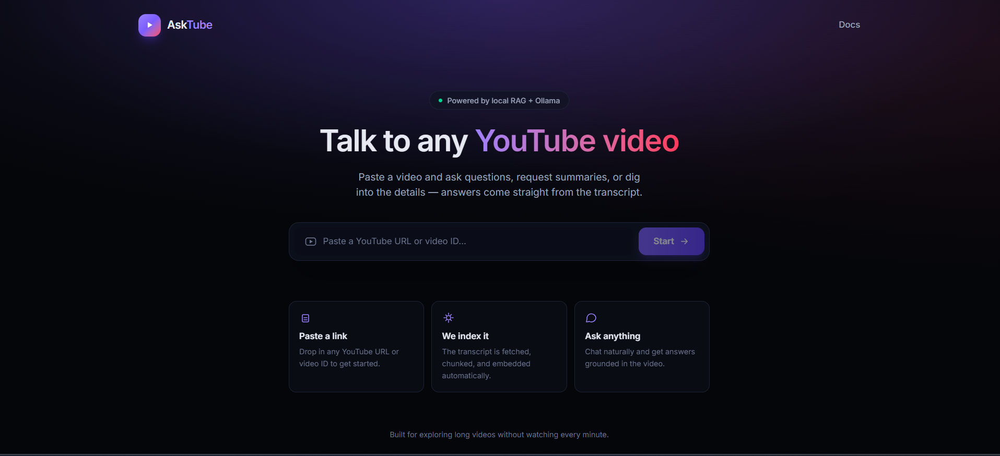
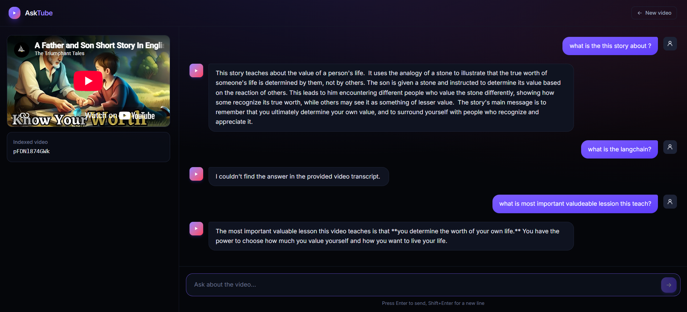

# AskTube — YouTube RAG Chat

Paste a YouTube video link, and chat with an AI about its transcript. The backend
indexes the video's transcript into a local vector store and answers questions
using retrieval-augmented generation (RAG) with a local LLM via Ollama. The
frontend is a Vite + React + TypeScript app.

## Screenshots

| Landing page | Chat |
| --- | --- |
|  |  |

## Architecture

- **Backend** — FastAPI, LangChain, ChromaDB (local persistent vector store),
  Ollama (`gemma2:2b` for chat, `nomic-embed-text` for embeddings).
- **Frontend** — Vite, React, TypeScript, Tailwind CSS.

## Prerequisites

- **Python** 3.11+ (developed on 3.13)
- **Node.js** 18+ and npm
- **Ollama** installed and running — [ollama.com/download](https://ollama.com/download)
- The two Ollama models this project uses, pulled locally:
  ```bash
  ollama pull gemma2:2b
  ollama pull nomic-embed-text
  ```

## 1. Backend setup

```bash
cd backend
python -m venv .venv

# Activate the virtual environment
.venv\Scripts\activate      # Windows
source .venv/bin/activate   # macOS/Linux

pip install -r requirements.txt
```

Make sure Ollama is running in the background (the Ollama app, or `ollama serve`)
before starting the API — the backend calls it for both embeddings and chat.

### Run the backend

```bash
uvicorn app.main:app --reload --port 8000
```

The API will be available at `http://127.0.0.1:8000` (Swagger docs at `/docs`).
A `chroma_db/` folder will be created next to `backend/app` on first run to
persist indexed transcripts.

## 2. Frontend setup

```bash
cd frontend
npm install
```

By default the frontend talks to `http://localhost:8000`. If your backend runs
somewhere else, copy `.env.example` to `.env` and set `VITE_API_BASE_URL`:

```bash
cp .env.example .env
```

### Run the frontend

```bash
npm run dev
```

The app will be available at `http://localhost:5173`.

## 3. Using the app

1. Open `http://localhost:5173`.
2. Paste a YouTube URL (e.g. `https://www.youtube.com/watch?v=VIDEO_ID`) or just
   the 11-character video ID, then click **Start**. The backend fetches the
   transcript, chunks it, embeds it, and stores it in Chroma.
3. Once indexing finishes, ask questions in the chat panel — answers are
   grounded only in that video's transcript.

> Note: the current backend keeps a single video indexed at a time — starting a
> new video replaces the previously indexed transcript.

## API reference

| Method | Endpoint                | Body                    | Description                              |
| ------ | ------------------------ | ------------------------ | ----------------------------------------- |
| POST   | `/youtube/{id}`          | —                         | Fetch, chunk, and index a video's transcript by its YouTube video ID. |
| POST   | `/youtube/chatllm`       | `{ "query": "string" }`  | Ask a question about the currently indexed transcript. |

## Troubleshooting

- **CORS errors in the browser** — the backend only allows requests from
  `http://localhost:5173` / `http://127.0.0.1:5173`. If you run the frontend on
  a different port, update the `allow_origins` list in `backend/app/main.py`.
- **"No transcript was found for this video." / "Transcripts are disabled"** —
  the video has no captions available, or captions are disabled by the
  uploader. Try a different video.
- **Chat requests hang or fail** — confirm Ollama is running (`ollama list`
  should show `gemma2:2b` and `nomic-embed-text`) and that the backend process
  can reach it.
